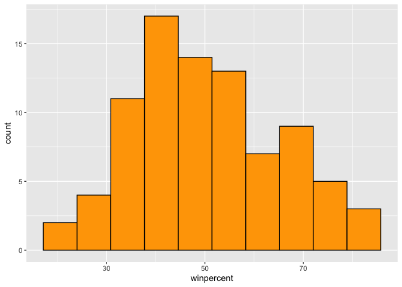

Class 10
================
Jennifer Swindlehurst Chan
2022-10-28

- <a href="#background" id="toc-background">Background</a>
- <a href="#part-1" id="toc-part-1">Part 1</a>
  - <a href="#q1" id="toc-q1">Q1:</a>
  - <a href="#q2" id="toc-q2">Q2:</a>
- <a href="#part-2" id="toc-part-2">Part 2</a>
  - <a href="#q3" id="toc-q3">Q3:</a>
  - <a href="#q4" id="toc-q4">Q4:</a>
  - <a href="#q5" id="toc-q5">Q5:</a>
  - <a href="#q6" id="toc-q6">Q6:</a>
  - <a href="#q7" id="toc-q7">Q7:</a>
  - <a href="#q8" id="toc-q8">Q8:</a>
  - <a href="#q9" id="toc-q9">Q9:</a>
  - <a href="#q10" id="toc-q10">Q10:</a>
  - <a href="#q11" id="toc-q11">Q11:</a>
  - <a href="#q12" id="toc-q12">Q12:</a>
- <a href="#part-3" id="toc-part-3">Part 3</a>
  - <a href="#q13" id="toc-q13">Q13:</a>
  - <a href="#q14" id="toc-q14">Q14:</a>
  - <a href="#q15" id="toc-q15">Q15:</a>
  - <a href="#q16" id="toc-q16">Q16:</a>
  - <a href="#q17" id="toc-q17">Q17:</a>
  - <a href="#q18" id="toc-q18">Q18:</a>
- <a href="#part-4" id="toc-part-4">Part 4</a>
  - <a href="#q19" id="toc-q19">Q19:</a>
  - <a href="#q20" id="toc-q20">Q20:</a>
  - <a href="#q21" id="toc-q21">Q21:</a>
- <a href="#part-5" id="toc-part-5">Part 5</a>
  - <a href="#q22" id="toc-q22">Q22:</a>
  - <a href="#q23" id="toc-q23">Q23:</a>
- <a href="#part-6" id="toc-part-6">Part 6</a>
  - <a href="#q24" id="toc-q24">Q24:</a>

## Background

# Part 1

In this mini-project we will examine 538 Halloween Candy data. What is
your favorite candy? What is nougat anyway? And how do you say it in
American?

First step is to read the data…

``` r
candy <- read.csv("candy-data.csv", row.names=1)
head(candy)
```

                 chocolate fruity caramel peanutyalmondy nougat crispedricewafer
    100 Grand            1      0       1              0      0                1
    3 Musketeers         1      0       0              0      1                0
    One dime             0      0       0              0      0                0
    One quarter          0      0       0              0      0                0
    Air Heads            0      1       0              0      0                0
    Almond Joy           1      0       0              1      0                0
                 hard bar pluribus sugarpercent pricepercent winpercent
    100 Grand       0   1        0        0.732        0.860   66.97173
    3 Musketeers    0   1        0        0.604        0.511   67.60294
    One dime        0   0        0        0.011        0.116   32.26109
    One quarter     0   0        0        0.011        0.511   46.11650
    Air Heads       0   0        0        0.906        0.511   52.34146
    Almond Joy      0   1        0        0.465        0.767   50.34755

## Q1:

There are 85 different candy types in this data set.

``` r
dim(candy)
```

    [1] 85 12

``` r
nrow(candy)
```

    [1] 85

## Q2:

There are 38 candies categorized as “fruity”.

``` r
sum(candy$fruity)
```

    [1] 38

``` r
table(candy$fruity)
```


     0  1 
    47 38 

# Part 2

## Q3:

My favorite candy is Sour Patch Kids and its win percent is 59.864%.

``` r
candy["Sour Patch Kids",]$winpercent
```

    [1] 59.864

## Q4:

The win percent value for Kit Kat is 76.7686%.

``` r
candy["Kit Kat",]$winpercent
```

    [1] 76.7686

## Q5:

The win percent for Tootsie Roll Snack Bars is 49.6535%.

``` r
candy["Tootsie Roll Snack Bars",]$winpercent
```

    [1] 49.6535

``` r
skimr::skim(candy)
```

|                                                  |       |
|:-------------------------------------------------|:------|
| Name                                             | candy |
| Number of rows                                   | 85    |
| Number of columns                                | 12    |
| \_\_\_\_\_\_\_\_\_\_\_\_\_\_\_\_\_\_\_\_\_\_\_   |       |
| Column type frequency:                           |       |
| numeric                                          | 12    |
| \_\_\_\_\_\_\_\_\_\_\_\_\_\_\_\_\_\_\_\_\_\_\_\_ |       |
| Group variables                                  | None  |

Data summary

**Variable type: numeric**

| skim_variable    | n_missing | complete_rate |  mean |    sd |    p0 |   p25 |   p50 |   p75 |  p100 | hist  |
|:-----------------|----------:|--------------:|------:|------:|------:|------:|------:|------:|------:|:------|
| chocolate        |         0 |             1 |  0.44 |  0.50 |  0.00 |  0.00 |  0.00 |  1.00 |  1.00 | ▇▁▁▁▆ |
| fruity           |         0 |             1 |  0.45 |  0.50 |  0.00 |  0.00 |  0.00 |  1.00 |  1.00 | ▇▁▁▁▆ |
| caramel          |         0 |             1 |  0.16 |  0.37 |  0.00 |  0.00 |  0.00 |  0.00 |  1.00 | ▇▁▁▁▂ |
| peanutyalmondy   |         0 |             1 |  0.16 |  0.37 |  0.00 |  0.00 |  0.00 |  0.00 |  1.00 | ▇▁▁▁▂ |
| nougat           |         0 |             1 |  0.08 |  0.28 |  0.00 |  0.00 |  0.00 |  0.00 |  1.00 | ▇▁▁▁▁ |
| crispedricewafer |         0 |             1 |  0.08 |  0.28 |  0.00 |  0.00 |  0.00 |  0.00 |  1.00 | ▇▁▁▁▁ |
| hard             |         0 |             1 |  0.18 |  0.38 |  0.00 |  0.00 |  0.00 |  0.00 |  1.00 | ▇▁▁▁▂ |
| bar              |         0 |             1 |  0.25 |  0.43 |  0.00 |  0.00 |  0.00 |  0.00 |  1.00 | ▇▁▁▁▂ |
| pluribus         |         0 |             1 |  0.52 |  0.50 |  0.00 |  0.00 |  1.00 |  1.00 |  1.00 | ▇▁▁▁▇ |
| sugarpercent     |         0 |             1 |  0.48 |  0.28 |  0.01 |  0.22 |  0.47 |  0.73 |  0.99 | ▇▇▇▇▆ |
| pricepercent     |         0 |             1 |  0.47 |  0.29 |  0.01 |  0.26 |  0.47 |  0.65 |  0.98 | ▇▇▇▇▆ |
| winpercent       |         0 |             1 | 50.32 | 14.71 | 22.45 | 39.14 | 47.83 | 59.86 | 84.18 | ▃▇▆▅▂ |

## Q6:

The win percent variable looks to be on a different scale to the
majority of the others in the dataset

## Q7:

For candy\$chocolate, the 0 and 1 means that it either is or is not a
chocolate candy. 0 means it isn’t, 1 means it is.

## Q8:

``` r
hist(candy$winpercent)
```


``` r
library(ggplot2)

ggplot(candy, aes(winpercent,)) +
  geom_histogram(bins=10, col="black", fill="orange")
```



## Q9:

The distribution is not totally symmestrical.

## Q10:

The center of the distribution is below 50%

## Q11:

Chocolate candy does rank better than fruity candy on average.

``` r
as.logical(candy$chocolate)
```

     [1]  TRUE  TRUE FALSE FALSE FALSE  TRUE  TRUE FALSE FALSE FALSE  TRUE FALSE
    [13] FALSE FALSE FALSE FALSE FALSE FALSE FALSE FALSE FALSE FALSE  TRUE  TRUE
    [25]  TRUE  TRUE FALSE  TRUE  TRUE FALSE FALSE FALSE  TRUE  TRUE FALSE  TRUE
    [37]  TRUE  TRUE  TRUE  TRUE  TRUE FALSE  TRUE  TRUE FALSE FALSE FALSE  TRUE
    [49] FALSE FALSE FALSE  TRUE  TRUE  TRUE  TRUE FALSE  TRUE FALSE FALSE  TRUE
    [61] FALSE FALSE  TRUE FALSE  TRUE  TRUE FALSE FALSE FALSE FALSE FALSE FALSE
    [73] FALSE FALSE  TRUE  TRUE  TRUE  TRUE FALSE  TRUE FALSE FALSE FALSE FALSE
    [85]  TRUE

``` r
choc_stats <- candy$winpercent[as.logical(candy$chocolate)]
choc_win <- mean(candy$winpercent[as.logical(candy$chocolate)])
choc_win
```

    [1] 60.92153

``` r
fruit_stats <- candy$winpercent[as.logical(candy$fruity)]
fruit_win <- mean(candy$winpercent[as.logical(candy$fruity)])
fruit_win
```

    [1] 44.11974

``` r
choc_win > fruit_win
```

    [1] TRUE

``` r
fruit_win > choc_win
```

    [1] FALSE

## Q12:

Yes, it is statistically different, the p value is lower than 0.5.

``` r
t.test(choc_stats, fruit_stats)
```


        Welch Two Sample t-test

    data:  choc_stats and fruit_stats
    t = 6.2582, df = 68.882, p-value = 2.871e-08
    alternative hypothesis: true difference in means is not equal to 0
    95 percent confidence interval:
     11.44563 22.15795
    sample estimates:
    mean of x mean of y 
     60.92153  44.11974 

# Part 3

The base R `sort()` and `order()` functions are very useful!

## Q13:

The least 5 liked candies are: Nik L Nip, Boston Baked Beans, Chiclets,
Super Bubble, and Jawbusters.

``` r
head(sort(candy$winpercent), n=5)
```

    [1] 22.44534 23.41782 24.52499 27.30386 28.12744

``` r
head(candy[order(candy$winpercent),], n=5)
```

                       chocolate fruity caramel peanutyalmondy nougat
    Nik L Nip                  0      1       0              0      0
    Boston Baked Beans         0      0       0              1      0
    Chiclets                   0      1       0              0      0
    Super Bubble               0      1       0              0      0
    Jawbusters                 0      1       0              0      0
                       crispedricewafer hard bar pluribus sugarpercent pricepercent
    Nik L Nip                         0    0   0        1        0.197        0.976
    Boston Baked Beans                0    0   0        1        0.313        0.511
    Chiclets                          0    0   0        1        0.046        0.325
    Super Bubble                      0    0   0        0        0.162        0.116
    Jawbusters                        0    1   0        1        0.093        0.511
                       winpercent
    Nik L Nip            22.44534
    Boston Baked Beans   23.41782
    Chiclets             24.52499
    Super Bubble         27.30386
    Jawbusters           28.12744

``` r
library(dplyr)
```


    Attaching package: 'dplyr'

    The following objects are masked from 'package:stats':

        filter, lag

    The following objects are masked from 'package:base':

        intersect, setdiff, setequal, union

``` r
candy %>%
  arrange(winpercent) %>%
  head(5)
```

                       chocolate fruity caramel peanutyalmondy nougat
    Nik L Nip                  0      1       0              0      0
    Boston Baked Beans         0      0       0              1      0
    Chiclets                   0      1       0              0      0
    Super Bubble               0      1       0              0      0
    Jawbusters                 0      1       0              0      0
                       crispedricewafer hard bar pluribus sugarpercent pricepercent
    Nik L Nip                         0    0   0        1        0.197        0.976
    Boston Baked Beans                0    0   0        1        0.313        0.511
    Chiclets                          0    0   0        1        0.046        0.325
    Super Bubble                      0    0   0        0        0.162        0.116
    Jawbusters                        0    1   0        1        0.093        0.511
                       winpercent
    Nik L Nip            22.44534
    Boston Baked Beans   23.41782
    Chiclets             24.52499
    Super Bubble         27.30386
    Jawbusters           28.12744

## Q14:

The most liked candies are Reese’s Peanut Butter Cup, Reese’s
Miniatures, Twix, Kit Kat, Snickers.

``` r
tail(candy[order(candy$winpercent),], n=5)
```

                              chocolate fruity caramel peanutyalmondy nougat
    Snickers                          1      0       1              1      1
    Kit Kat                           1      0       0              0      0
    Twix                              1      0       1              0      0
    ReeseÕs Miniatures                1      0       0              1      0
    ReeseÕs Peanut Butter cup         1      0       0              1      0
                              crispedricewafer hard bar pluribus sugarpercent
    Snickers                                 0    0   1        0        0.546
    Kit Kat                                  1    0   1        0        0.313
    Twix                                     1    0   1        0        0.546
    ReeseÕs Miniatures                       0    0   0        0        0.034
    ReeseÕs Peanut Butter cup                0    0   0        0        0.720
                              pricepercent winpercent
    Snickers                         0.651   76.67378
    Kit Kat                          0.511   76.76860
    Twix                             0.906   81.64291
    ReeseÕs Miniatures               0.279   81.86626
    ReeseÕs Peanut Butter cup        0.651   84.18029

``` r
candy %>%
  arrange(winpercent) %>%
  tail(5)
```

                              chocolate fruity caramel peanutyalmondy nougat
    Snickers                          1      0       1              1      1
    Kit Kat                           1      0       0              0      0
    Twix                              1      0       1              0      0
    ReeseÕs Miniatures                1      0       0              1      0
    ReeseÕs Peanut Butter cup         1      0       0              1      0
                              crispedricewafer hard bar pluribus sugarpercent
    Snickers                                 0    0   1        0        0.546
    Kit Kat                                  1    0   1        0        0.313
    Twix                                     1    0   1        0        0.546
    ReeseÕs Miniatures                       0    0   0        0        0.034
    ReeseÕs Peanut Butter cup                0    0   0        0        0.720
                              pricepercent winpercent
    Snickers                         0.651   76.67378
    Kit Kat                          0.511   76.76860
    Twix                             0.906   81.64291
    ReeseÕs Miniatures               0.279   81.86626
    ReeseÕs Peanut Butter cup        0.651   84.18029

## Q15:

``` r
library(ggplot2)

ggplot(candy, aes(winpercent, rownames(candy))) +
  geom_col() +
  theme(text = element_text(size=5))
```


## Q16:

``` r
ggplot(candy) + aes(winpercent, reorder(rownames(candy), winpercent)) +
  geom_col() +
  theme(text = element_text(size=5))
```


``` r
my_cols=rep("black", nrow(candy))
my_cols[as.logical(candy$chocolate)] = "chocolate"
my_cols[as.logical(candy$bar)] = "brown"
my_cols[as.logical(candy$fruity)] = "pink"
```

``` r
ggplot(candy) + 
  aes(winpercent, reorder(rownames(candy),winpercent)) +
  geom_col(fill=my_cols) +
  theme(text = element_text(size=5))
```


``` r
ggsave("mybarplot.png")
```

    Saving 7 x 5 in image

## Q17:

The worst ranked chocolate candy is Sixlets.

## Q18:

The best ranked fruity candy is Starburst.

# Part 4

``` r
library(ggrepel)

ggplot(candy) +
  aes(winpercent, pricepercent, label=rownames(candy)) +
  geom_point(col=my_cols) + 
  geom_text_repel(col=my_cols, size=2, max.overlaps = 100)
```


## Q19:

Reese’s Miniatures has a high win percent ranking but is pretty low
price percentage.

## Q20:

The 5 most expensive candy types are Hershey’s Special Dark, Mr Goof
Bar, Ring pop, Nik L Nip, and Nestle Smarties. Nik L Nip is the lowest
ranked at the highest price.

``` r
most_money <- candy %>%
  arrange(pricepercent) %>%
  tail(5)

most_money
```

                           chocolate fruity caramel peanutyalmondy nougat
    HersheyÕs Special Dark         1      0       0              0      0
    Mr Good Bar                    1      0       0              1      0
    Ring pop                       0      1       0              0      0
    Nik L Nip                      0      1       0              0      0
    Nestle Smarties                1      0       0              0      0
                           crispedricewafer hard bar pluribus sugarpercent
    HersheyÕs Special Dark                0    0   1        0        0.430
    Mr Good Bar                           0    0   1        0        0.313
    Ring pop                              0    1   0        0        0.732
    Nik L Nip                             0    0   0        1        0.197
    Nestle Smarties                       0    0   0        1        0.267
                           pricepercent winpercent
    HersheyÕs Special Dark        0.918   59.23612
    Mr Good Bar                   0.918   54.52645
    Ring pop                      0.965   35.29076
    Nik L Nip                     0.976   22.44534
    Nestle Smarties               0.976   37.88719

``` r
#candy[order$winpercent,]
```

``` r
most_money[order(most_money$winpercent),]
```

                           chocolate fruity caramel peanutyalmondy nougat
    Nik L Nip                      0      1       0              0      0
    Ring pop                       0      1       0              0      0
    Nestle Smarties                1      0       0              0      0
    Mr Good Bar                    1      0       0              1      0
    HersheyÕs Special Dark         1      0       0              0      0
                           crispedricewafer hard bar pluribus sugarpercent
    Nik L Nip                             0    0   0        1        0.197
    Ring pop                              0    1   0        0        0.732
    Nestle Smarties                       0    0   0        1        0.267
    Mr Good Bar                           0    0   1        0        0.313
    HersheyÕs Special Dark                0    0   1        0        0.430
                           pricepercent winpercent
    Nik L Nip                     0.976   22.44534
    Ring pop                      0.965   35.29076
    Nestle Smarties               0.976   37.88719
    Mr Good Bar                   0.918   54.52645
    HersheyÕs Special Dark        0.918   59.23612

``` r
ord <- order(candy$pricepercent, decreasing = TRUE)
head( candy[ord,c(11,12)], n=5 )
```

                             pricepercent winpercent
    Nik L Nip                       0.976   22.44534
    Nestle Smarties                 0.976   37.88719
    Ring pop                        0.965   35.29076
    HersheyÕs Krackel               0.918   62.28448
    HersheyÕs Milk Chocolate        0.918   56.49050

## Q21:

``` r
ggplot(candy) +
  aes(pricepercent, reorder(rownames(candy), pricepercent)) +
  geom_segment(aes(yend = reorder(rownames(candy), pricepercent), 
                   xend = 0), col="gray40") +
    geom_point()
```


# Part 5

``` r
library(corrplot)
```

    corrplot 0.92 loaded

``` r
cij <- cor(candy)
corrplot(cij)
```


## Q22:

Fruity and chocolate are anti-correlated.

## Q23:

Chocolate with win percent and bar are most positively correlated.

# Part 6

``` r
pca <- prcomp(candy, scale=T)
summary(pca)
```

    Importance of components:
                              PC1    PC2    PC3     PC4    PC5     PC6     PC7
    Standard deviation     2.0788 1.1378 1.1092 1.07533 0.9518 0.81923 0.81530
    Proportion of Variance 0.3601 0.1079 0.1025 0.09636 0.0755 0.05593 0.05539
    Cumulative Proportion  0.3601 0.4680 0.5705 0.66688 0.7424 0.79830 0.85369
                               PC8     PC9    PC10    PC11    PC12
    Standard deviation     0.74530 0.67824 0.62349 0.43974 0.39760
    Proportion of Variance 0.04629 0.03833 0.03239 0.01611 0.01317
    Cumulative Proportion  0.89998 0.93832 0.97071 0.98683 1.00000

``` r
plot(pca$x[,1:2], col=my_cols, pch=16)
```


``` r
my_data <- cbind(candy, pca$x[,1:3])
```

``` r
p <- ggplot(my_data) + 
      aes(x=PC1, y=PC2, 
        size=winpercent/100,  
        text=rownames(my_data),
        label=rownames(my_data)) +
      geom_point(col=my_cols)

p
```


``` r
library(ggrepel)

p + geom_text_repel(size=3.3, col=my_cols, max.overlaps = 100)  + 
  theme(legend.position = "none") +
  labs(title="Halloween Candy PCA Space",
       subtitle="Colored by type: chocolate bar (dark brown), chocolate other (light brown), fruity (red), other (black)",
       caption="Data from 538")
```


``` r
library(plotly)
```


    Attaching package: 'plotly'

    The following object is masked from 'package:ggplot2':

        last_plot

    The following object is masked from 'package:stats':

        filter

    The following object is masked from 'package:graphics':

        layout

``` r
#ggplotly(p)
```

``` r
par(mar=c(8,4,2,2))
barplot(pca$rotation[,1], las=2, ylab="PC1 Contribution")
```


## Q24:

Fruity, hard, and pluribus are picked up strongly by PC1 in the positive
direction. This makes sense because fruity candies are usually hard and
pluribus, these variables are positively correlated in the correlation
plot. Also considering that fruity and chocolate were very negatively
correlated in the correlation plot (and fruity is high here, while
chocolate is low). Additionally, chocolate was a bit negatively
correlated with hard and pluribus (in the correlation plot).
